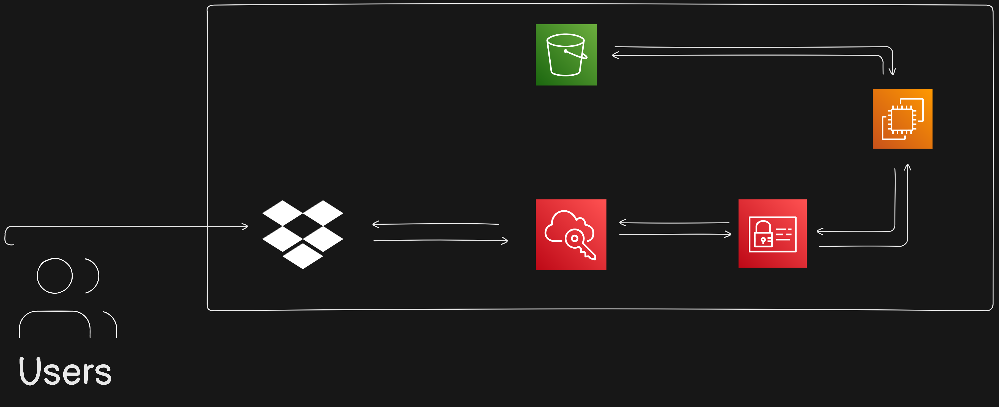

### 📂 **Build Own Cloud**

---

#### **1. Client Access Layer**
   - **Users** can access the FileCloud instance via a **web browser** or **mobile/desktop apps**. Access is managed through **role-based authentication** and **secure connections** (HTTPS/TLS).
   
---

#### **2. AWS Compute Layer: FileCloud Application Server**
   - **EC2 Instance**: Use an **Amazon EC2 T2 Medium instance** to host FileCloud. This instance type provides sufficient CPU and memory for optimal performance in a small to medium-scale environment.
     - **FileCloud Installation**: FileCloud application is installed here, including configurations for handling user authentication, data indexing, and UI.
     - **FileCloud License**: Upload a valid license file to activate FileCloud's full features.

   - **IAM Role**: Attach an IAM role to the EC2 instance to securely manage access to Amazon S3 for file storage.
     - **Security Group**: Configure the EC2 instance's security group to allow inbound traffic on required ports (e.g., 80 for HTTP, 443 for HTTPS) and restrict other ports.

---

#### **3. AWS Storage Layer: Amazon S3**
   - **Primary File Storage**: Configure Amazon S3 as the primary storage for FileCloud. 
     - **Storage Tiers**: Utilize different S3 storage tiers based on data access frequency. For example:
       - **Standard Tier**: For frequently accessed data.
       - **Infrequent Access**: For less frequently accessed files.
       - **Glacier**: For archival storage to further reduce costs.

   - **Configuration Steps**:
     - **IAM User with S3 Access**: Create an IAM user with the necessary permissions for S3 (GetObject, PutObject, etc.). Generate access keys to be used by FileCloud.
     - **Cloud Config Modification**: Update the `cloudconfig.php` file in FileCloud to set Amazon S3 as the storage endpoint, using the IAM user’s access credentials.

---

#### **4. Data Governance and Security Layer**
   - **Encryption**: Enable S3 server-side encryption for stored data and use HTTPS/TLS for secure data transmission.
   - **Access Control Policies**: Set up strict IAM policies to control access to FileCloud resources.
   - **Monitoring & Logging**: Use **AWS CloudTrail** and **Amazon CloudWatch** to monitor access and changes to files, ensuring compliance and audit readiness.

---

#### **5. Backup and Disaster Recovery Layer**
   - **Automatic Backups**: Schedule regular snapshots of the EC2 instance and periodic backups of critical FileCloud configuration files.
   - **Cross-Region Replication (Optional)**: Configure S3 Cross-Region Replication if required for additional redundancy, especially if serving a geographically diverse user base.

---

### **Architecture Diagram Outline**

1. **User** ↔ **HTTPS/TLS** ↔ **EC2 Instance with FileCloud Application (T2 Medium)** ↔ **IAM Role for S3 Access** ↔ **Amazon S3 (Multi-Tier Storage)**

2. **Monitoring & Logs**: Integrate with **AWS CloudTrail** and **CloudWatch** for monitoring file access and system health.

3. **Backup and Replication**: Set up **S3 Cross-Region Replication** and **EC2 Snapshots** for disaster recovery.

---

### **Benefits of This Architecture**
- **Data Control and Security**: Full data control with S3 storage and access control via IAM policies.
- **Cost Optimization**: Lower costs by utilizing various S3 storage tiers based on data access needs.
- **Scalability**: Leverage AWS's infrastructure for scaling storage independently of compute resources.
- **Remote Access**: Users can securely access files from anywhere, similar to traditional cloud storage services.

This architecture provides a secure, flexible, and cost-effective setup for a self-hosted cloud solution with enterprise-level data governance features, ideal for organizations seeking control over their data storage.
